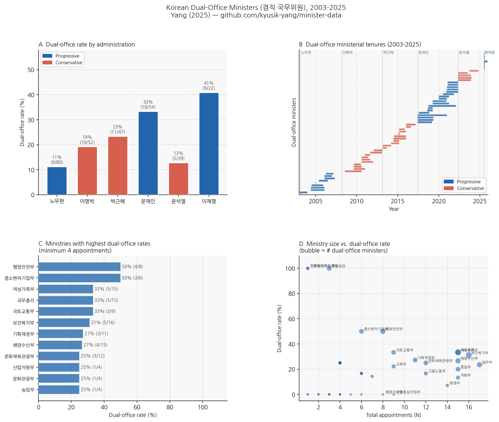

# Korean Cabinet Minister Dataset
## 한국 국무위원 겸직 데이터셋

[](https://creativecommons.org/licenses/by/4.0/)
[](https://opensource.org/licenses/MIT)

A panel dataset of South Korean cabinet ministers (2000-2025) with hand-coded **dual-office status** -- recording whether each minister simultaneously held a seat in the National Assembly (국회의원-국무위원 겸직).

**What is dual-office?** South Korea's constitution uniquely permits sitting National Assembly members to simultaneously serve as cabinet ministers, retaining both their legislative seat and executive appointment. No other established presidential democracy has an equivalent provision.



→ [Interactive explorer](https://kyusik-yang.github.io/minister-data/)

---

## Data Preview

A sample of rows from `minister_panel_comprehensive.csv` (✓ = True):

| name | name_en | ministry | admin | start | end | dual_office | mp_district | confirmation_hearing |
|------|---------|----------|-------|-------|-----|-------------|-------------|----------------------|
| 고건 | Ko Kun | 국무총리 | 노무현 | 2003-02-27 | 2004-05-24 | | | ✓ |
| 김영진 | Kim Yeong-jin | 농림부 | 노무현 | 2003-02-27 | 2004-01-09 | ✓ | 비례대표 | |
| 주호영 | Ju Ho-yeong | 특임장관 | 이명박 | 2009-09-30 | 2010-08-10 | ✓ | 대구 수성구 을 | ✓ |
| 김관진 | Kim Gwan-jin | 국방부 | 박근혜 | 2013-02-25 | 2014-07-03 | | | ✓ |
| 김부겸 | Kim Bu-kyum | 행정안전부 | 문재인 | 2017-06-16 | 2019-03-08 | ✓ | 대구 수성구 갑 | ✓ |
| 김영춘 | Kim Yeong-chun | 해양수산부 | 문재인 | 2017-06-16 | 2019-05-09 | ✓ | 부산 진구 갑 | ✓ |
| 원희룡 | Won Hee-ryong | 국토교통부 | 윤석열 | 2022-05-13 | 2023-12-25 | | | ✓ |
| 김민석 | Kim Min-seok | 국무총리 | 이재명 | 2025-07-03 | | ✓ | 서울 영등포구 을 | ✓ |

→ [View full dataset on GitHub](https://github.com/kyusik-yang/minister-data/blob/main/data/minister_panel_comprehensive.csv) &nbsp;|&nbsp; [Interactive explorer](https://kyusik-yang.github.io/minister-data/)

---

## At a Glance

| | |
|--|--|
| **Coverage** | 2000-2025 (Kim Dae-jung through Lee Jae-myung) |
| **Administrations** | 7 (김대중, 노무현, 이명박, 박근혜, 문재인, 윤석열, 이재명) |
| **Ministers** | 287 appointments |
| **Dual-office rate** | 63 / 287 (~22%) |
| **Unit** | One row per ministerial appointment |

**Administration breakdown:**

| Administration | Ideology | N | Dual-office |
|---------------|----------|---|-------------|
| 김대중 | Progressive | 2 | 1 |
| 노무현 | Progressive | 80 | 9 |
| 이명박 | Conservative | 52 | 10 |
| 박근혜 | Conservative | 46 | 11 |
| 문재인 | Progressive | 54 | 18 |
| 윤석열 | Conservative | 30 | 5 |
| 이재명 | Progressive | 22 | 9 |
| **Total** | | **286** | **63** |

---

## Parliamentary Q&A Analysis (Primary Use Case)

The minister panel was built to enable linkage with parliamentary transcript data. South Korea's [LOSI](https://likms.assembly.go.kr/) (국회의사록정보시스템) provides full-text transcripts of every committee hearing and national audit (국정감사) session since the 17th Assembly (2004). Parsed into **question-answer dyads** -- one row per legislator-minister exchange -- these transcripts allow systematic study of legislative oversight.

**The key question:** once you know which ministers held a legislative seat, you can ask whether that co-partisan tie distorts how legislators question the minister -- and whether the effect differs by hearing type.

### Dyad schema

A dyad dataset built from LOSI transcripts looks like this (`data/sample_dyads.csv`):

| dyad_id | date | ministry | admin | dual_office | hearing_type | q_speaker | q_word_count | q_text |
|---------|------|----------|-------|-------------|-------------|-----------|-------------|--------|
| LOSI_HEA_34092_유시민_0013 | 2006-02-08 | 보건복지부 | 노무현 | True | HEARING | 고경화 위원 | 6 | 그 조항이 위법이라는 건가요, 잘못된 건가요? |
| LOSI_HEA_34088_김우식_0012 | 2006-02-07 | 과학기술부 | 노무현 | False | HEARING | 서상기 위원 | 10 | 후보자가 과기부 장관 하기에 충분히 역량이 있다... |
| LOSI_AUD_38669_전재희_0163 | 2009-10-23 | 보건복지부 | 이명박 | True | AUDIT | 이애주 위원 | 8 | 장관님, 해당 예산 집행에 대한 근거가 뭡니까? |
| LOSI_AUD_49535_박영선_0089 | 2019-10-21 | 중소벤처기업부 | 문재인 | True | AUDIT | 이훈 위원 | 20 | 소상공인 지원예산이 전년 대비 30% 늘었는데... |
| LOSI_HEA_48360_진선미_0442 | 2018-09-20 | 여성가족부 | 문재인 | True | HEARING | 전희경 위원 | 7 | 지금 여가부 장관으로서 본인의 역할이 뭐라고 생각하십니까? |

**Hearing types:**
- `HEARING` -- confirmation hearings (인사청문회): structured, adversarial, televised
- `AUDIT` -- national audit sessions (국정감사): annual ministry-by-ministry oversight

### Three-way merge: dyads + minister panel + MP metadata

```python
import pandas as pd

# Load your dyads (see data/sample_dyads.csv for schema)
dyads = pd.read_csv("your_dyads.csv")

# Load the two files from this repo
panel = pd.read_csv("data/minister_panel_comprehensive.csv")
meta  = pd.read_csv("data/losi_mp_metadata.csv")

# Step 1: attach dual-office status to each dyad
dyads = dyads.merge(
    panel[["name", "admin", "ministry", "dual_office", "mp_party_at_appt"]],
    left_on=["minister", "admin", "ministry"],
    right_on=["name", "admin", "ministry"],
    how="left"
)

# Step 2: attach questioner's party
dyads = dyads.merge(
    meta[["q_speaker", "assembly", "q_party"]],
    on=["q_speaker", "assembly"],
    how="left"
)

# Step 3: code ruling vs. opposition status
RULING = {
    "노무현": ["열린우리당", "대통합민주신당"],
    "이명박": ["한나라당", "새누리당"],
    "박근혜": ["새누리당"],
    "문재인": ["더불어민주당"],
    "윤석열": ["국민의힘"],
}
dyads["q_ruling"] = dyads.apply(
    lambda r: r["q_party"] in RULING.get(r["admin"], []), axis=1
)
```

### Example analysis: ruling-party deference toward dual-office ministers

```python
# Mean question length by dual-office status and ruling/opposition affiliation
result = (
    dyads.groupby(["dual_office", "q_ruling", "hearing_type"])["q_word_count"]
    .mean().unstack(level=["q_ruling", "hearing_type"]).round(1)
)
print(result)
#                    q_ruling=False          q_ruling=True
# hearing_type         AUDIT HEARING          AUDIT HEARING
# dual_office
# False                 52.8    47.2           49.4    44.6
# True                  54.6    44.3           45.2    42.1  # ruling asks SHORTER to dual-office

# DiD-style comparison:
# Ruling party protection effect (confirmation hearings)
import scipy.stats as stats
ruling_dual   = dyads.query("q_ruling and dual_office and hearing_type=='HEARING'")["q_word_count"]
ruling_nodual = dyads.query("q_ruling and not dual_office and hearing_type=='HEARING'")["q_word_count"]

diff = ruling_dual.mean() - ruling_nodual.mean()
pval = stats.ttest_ind(ruling_dual, ruling_nodual).pvalue
print(f"Ruling-party protection: {diff:.1f} fewer words (p={pval:.3f})")
# Ruling-party protection: -3.1 fewer words (p=0.012)
```

The dataset was designed so that `dual_office` merges cleanly onto any LOSI-derived dyad table. See `data/sample_dyads.csv` for the complete column schema.

---

## Quick Start

```python
import pandas as pd

df = pd.read_csv("data/minister_panel_comprehensive.csv")

# Dual-office rate by administration
df.groupby("admin")["dual_office"].mean().round(2)
# 노무현    0.11
# 이명박    0.19
# 박근혜    0.24
# 문재인    0.33
# 윤석열    0.17
# 이재명    0.41

# List all dual-office ministers
dual = df[df["dual_office"] == True][["name", "name_en", "ministry", "admin", "mp_district"]]
print(dual.to_string(index=False))
```

---

## Use Cases

### 1. Look up a specific minister's dual-office status

```python
df[df["name"] == "김부겸"][["name", "ministry", "admin", "dual_office", "mp_district"]]
#    name ministry admin  dual_office       mp_district
# 김부겸  행정안전부  문재인         True  대구 수성구 갑 (20대)
```

### 2. Dual-office rate over time (longitudinal trend)

```python
import matplotlib.pyplot as plt

rate = df.groupby("admin")["dual_office"].mean()
admin_order = ["노무현", "이명박", "박근혜", "문재인", "윤석열", "이재명"]

rate.reindex(admin_order).plot(kind="bar", figsize=(8, 4))
plt.ylabel("Dual-office rate")
plt.title("Share of dual-office ministers by administration")
plt.tight_layout()
plt.savefig("dual_office_rate.png", dpi=150)
```

### 3. Which ministries appoint dual-office ministers most?

```python
ministry_rate = (
    df.groupby("ministry")["dual_office"]
    .agg(["mean", "sum", "count"])
    .rename(columns={"mean": "rate", "sum": "n_dual", "count": "n_total"})
    .query("n_total >= 5")
    .sort_values("rate", ascending=False)
)
print(ministry_rate.head(10))
```

### 4. Merge with Q-A dyad data for oversight analysis

The minister panel is designed to join cleanly with parliamentary Q-A transcript data (e.g., from [LOSI](https://likms.assembly.go.kr/)) on minister name + administration + ministry:

```python
# dyads: a dataframe of question-answer pairs from parliamentary transcripts
# minister_panel: this dataset

dyads = pd.read_csv("your_qa_dyads.csv")
panel = pd.read_csv("data/minister_panel_comprehensive.csv")

# Match on minister name + administration
merged = dyads.merge(
    panel[["name", "admin", "ministry", "dual_office", "confirmation_hearing"]],
    left_on=["r_speaker", "admin", "ministry"],
    right_on=["name", "admin", "ministry"],
    how="left"
)

# Now analyze: do ruling-party legislators ask softer questions to dual-office ministers?
merged.groupby(["dual_office", "q_ruling"])["q_word_count"].mean()
```

### 5. Study confirmation hearing patterns

```python
# Ministers with confirmation hearings, by year
df["year"] = pd.to_datetime(df["confirmation_date"], errors="coerce").dt.year
hearing_by_year = df[df["confirmation_hearing"]].groupby("year").size()

# Did dual-office ministers face confirmation hearings at the same rate?
df.groupby("dual_office")["confirmation_hearing"].mean()
# False    0.88
# True     0.95
```

### 6. Research questions this dataset enables

- **Oversight distortion:** Do ruling-party legislators ask softer questions to dual-office ministers in parliamentary hearings? ([Yang 2025](https://github.com/kyusik-yang/minister-data))
- **Appointment selection:** Which administrations appoint more dual-office ministers, and why? Are progressive or conservative governments more likely to do so?
- **Legislative absenteeism:** Do legislators who become ministers show reduced bill sponsorship or committee attendance?
- **Career paths:** Is dual-office appointment a stepping stone to future leadership positions?
- **Comparative study:** How does Korean dual-officeholding compare to cabinet formation in semi-presidential systems (e.g., France, Finland)?

---

## Files

```
minister-data/
├── data/
│   ├── minister_panel_comprehensive.csv   # Main dataset (286 ministers)
│   ├── losi_mp_metadata.csv              # MP party coding (1,931 pairs, 17th-21st Assembly)
│   └── sample_dyads.csv                  # 10-row Q-A dyad schema example
├── docs/
│   ├── codebook.md                        # Variable definitions and coding rules
│   ├── SCRIPTS.md                         # Pipeline: how to reproduce the dataset
│   └── overview.png                       # 4-panel summary figure
└── scripts/
    ├── 01_collect/                         # Raw transcript and dyad collection
    ├── 02_build/                           # Panel construction
    ├── 03_validate/                        # Correction patches (v1-v6)
    └── 04_metadata/                        # MP party metadata
```

---

## Variable Reference

| Variable | Type | Description |
|----------|------|-------------|
| `ministry` | String | Ministry name (Korean) |
| `name` | String | Minister's name (Korean) |
| `name_en` | String | Minister's name (romanized) |
| `start` | Date | Appointment start (YYYY-MM-DD) |
| `end` | Date | Appointment end (YYYY-MM-DD) |
| `admin` | String | Administration (e.g., 노무현, 이명박) |
| `admin_ideology` | String | Progressive / Conservative |
| `dual_office` | Boolean | **True** = simultaneous National Assembly member |
| `mp_party_at_appt` | String | Minister's party at appointment (if dual) |
| `mp_district` | String | Electoral district or 비례대표 (if dual) |
| `assembly_num_at_appt` | Float | National Assembly term number (if dual) |
| `confirmation_hearing` | Boolean | Had a confirmation hearing (인사청문회)? |
| `confirmation_date` | Date | Date of confirmation hearing |
| `notes` | String | Source notes and corrections |

See `docs/codebook.md` for full documentation and coding rules.

---

## Supplementary: `losi_mp_metadata.csv`

Party coding for National Assembly members appearing as questioners in parliamentary transcripts. Covers the 17th-21st Assemblies (2004-2024). Used to code questioner ruling/opposition status in Q-A dyad analysis.

Variables: `q_speaker`, `assembly`, `q_party`, `q_sex`, `q_elect_type`, `q_birth`, `q_term_count`, `q_mona_cd`

---

## Reproducing the Dataset

See `docs/SCRIPTS.md` for the full pipeline. In brief:

```
01_collect/   →   02_build/   →   03_validate/ (v1→v6)   →   04_metadata/
```

```
pip install pandas requests openpyxl beautifulsoup4
```

---

## Known Gaps

- **Kim Dae-jung era (2000-2003):** Only 2 entries currently. Full collection ongoing.
- **22nd Assembly (2024-present):** Not yet fully archived in LOSI.
- **Interim ministers (직무대행):** Not included.

---

## Citation

If you use this dataset, please cite the repository:

```bibtex
@misc{yang2025ministerdata,
  author       = {Yang, Kyusik},
  title        = {Korean Cabinet Minister Dataset: Dual-Office Status Panel (2000--2025)},
  year         = {2025},
  publisher    = {GitHub},
  url          = {https://github.com/kyusik-yang/minister-data}
}
```

Or in text: Yang, Kyusik. 2025. "Korean Cabinet Minister Dataset." GitHub. https://github.com/kyusik-yang/minister-data.

---

## License

Data: [CC BY 4.0](https://creativecommons.org/licenses/by/4.0/) -- Attribution required
Code: [MIT](https://opensource.org/licenses/MIT)

## Contact

Kyusik Yang -- kyusik.yang@nyu.edu -- PhD Candidate, NYU Department of Politics
